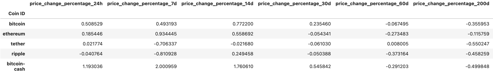
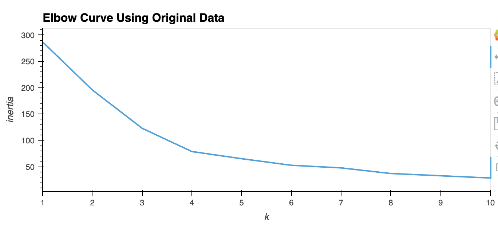
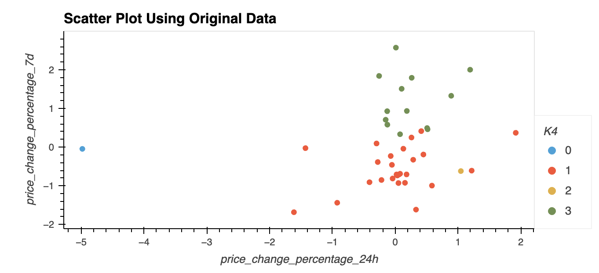
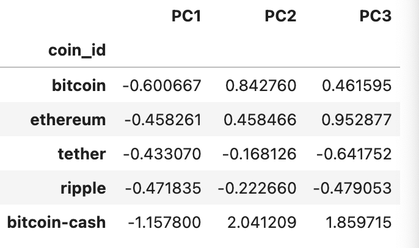
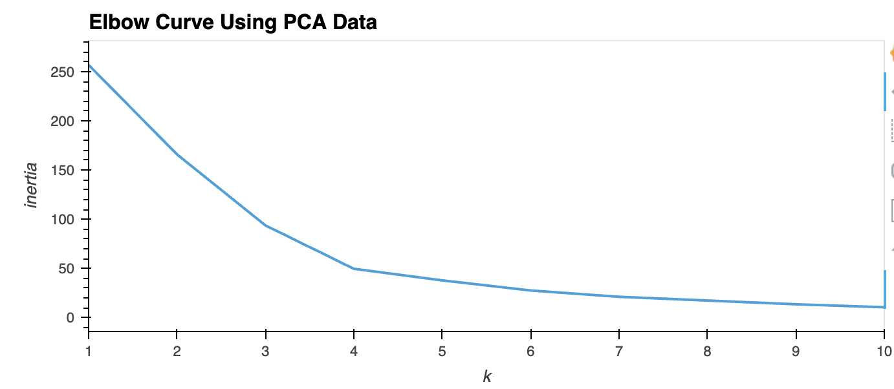
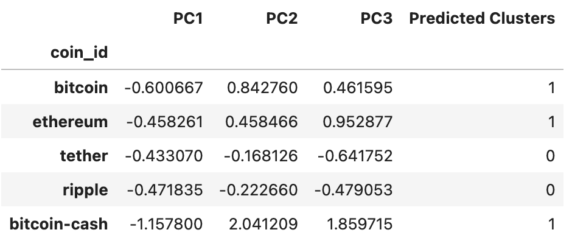
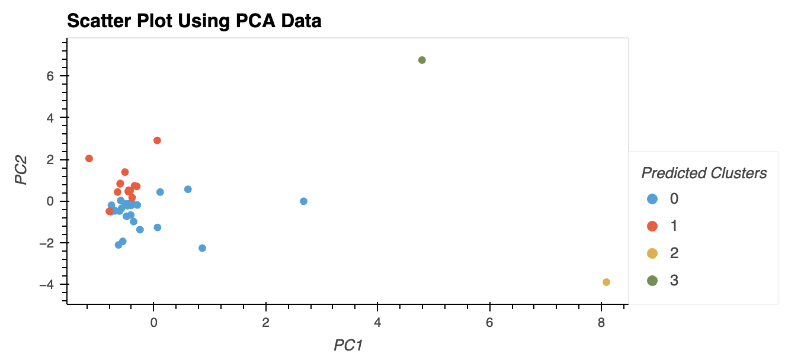
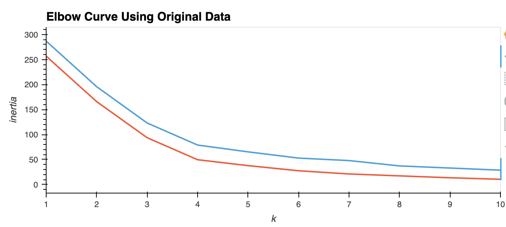
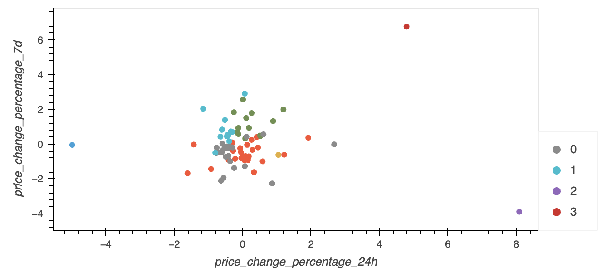

# CryptoClustering
Use your knowledge of Python and unsupervised learning to predict if cryptocurrencies are affected by 24-hour or 7-day price changes.

## Prepare the Data
* Use the StandardScaler() module from scikit-learn to normalize the data from the CSV file.
* Create a DataFrame with the scaled data and set the "coin_id" index from the original DataFrame as the index for the new DataFrame.\
* The first five rows of the scaled DataFrame should appear as follows:

* After preparing the data, this can be broken down into 5 parts. After which you can compare the plots.

## Find the Best Value for k Using the Original Scaled DataFrame
Use the elbow method to find the best value for k using the following steps:
* Create a list with the number of k values from 1 to 11.
* Create an empty list to store the inertia values.
* Create a for loop to compute the inertia with each possible value of k.
* Create a dictionary with the data to plot the elbow curve.
* Plot a line chart with all the inertia values computed with the different values of k to visually identify the optimal value for k.

#### Question 1. What is the best value for k? 
The best value for 'k' is 4. That is where the bend in the elbow happens, meaning there is less inertia lost after that point. The data    points are closest to their centroids once the inertia levels off.

## Cluster Cryptocurrencies with K-means Using the Original Scaled Data
* Use the following steps to cluster the cryptocurrencies for the best value for k on the original scaled data:
* Initialize the K-means model with the best value for k.
* Fit the K-means model using the original scaled DataFrame.
* Predict the clusters to group the cryptocurrencies using the original scaled DataFrame.
* Create a copy of the original data and add a new column with the predicted clusters.
* Create a scatter plot using hvPlot as follows:
* Set the x-axis as "price_change_percentage_24h" and the y-axis as "price_change_percentage_7d".
* Color the graph points with the labels found using K-means.
* Add the "coin_id" column in the hover_cols parameter to identify the cryptocurrency represented by each data point.

## Optimize Clusters with Principal Component Analysis
* Using the original scaled DataFrame, perform a PCA and reduce the features to three principal components.
* Retrieve the explained variance to determine how much information can be attributed to each principal component.
* Create a new DataFrame with the PCA data and set the "coin_id" index from the original DataFrame as the index for the new DataFrame.

#### Question 2. What is the total explained variance of the three principal components?
The explained variance is:0.89503166

## Find the Best Value for k Using the PCA Data
* Use the elbow method on the PCA data to find the best value for k using the following steps:
* Create a list with the number of k-values from 1 to 11.
* Create an empty list to store the inertia values.
* Create a for loop to compute the inertia with each possible value of k.
* Create a dictionary with the data to plot the Elbow curve.
* Plot a line chart with all the inertia values computed with the different values of k to visually identify the optimal value for k.

#### Question 3. What is the best value for `k` when using the PCA data?
The best value for 'k' when using the PCA data is 4.

#### Question 4. Does it differ from the best k value found using the original data?
There was no difference.

## Cluster Cryptocurrencies with K-means Using the PCA Data
* Use the following steps to cluster the cryptocurrencies for the best value for k on the PCA data:
* Initialize the K-means model with the best value for k.
* Fit the K-means model using the PCA data.
* Predict the clusters to group the cryptocurrencies using the PCA data.
* Create a copy of the DataFrame with the PCA data and add a new column to store the predicted clusters.

* Create a scatter plot using hvPlot as follows:
* Set the x-axis as "price_change_percentage_24h" and the y-axis as "price_change_percentage_7d".
* Color the graph points with the labels found using K-means.
* Add the "coin_id" column in the hover_cols parameter to identify the cryptocurrency represented by each data point.

## Comparing the data

#### Question 5. After visually analyzing the cluster analysis results, what is the impact of using fewer features to cluster the data using K-Means?
Using fewer featuers simplifies the data. It allows better clustering since there are less features to consider. However, this can also have a negative impact and cause overfitting of the data.
